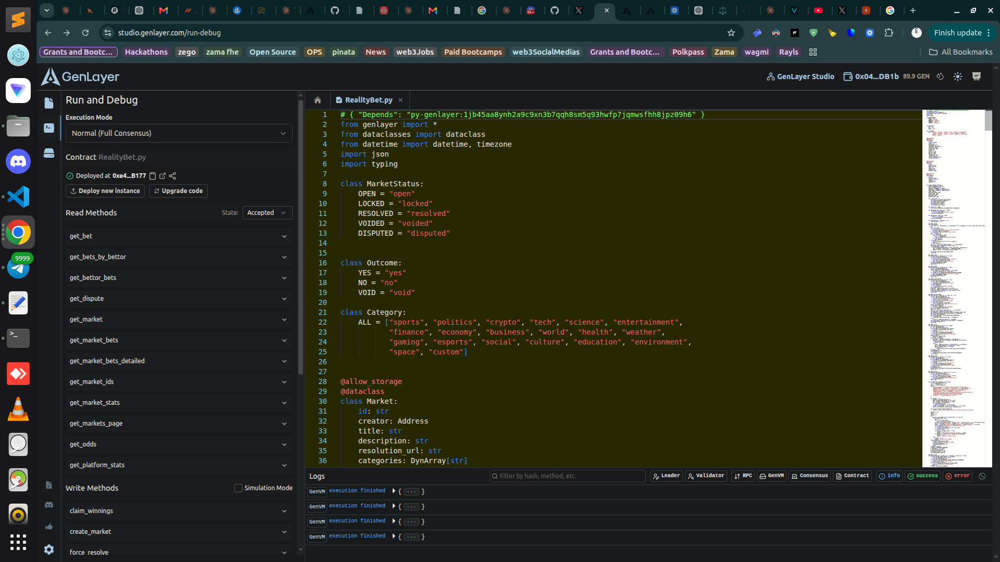
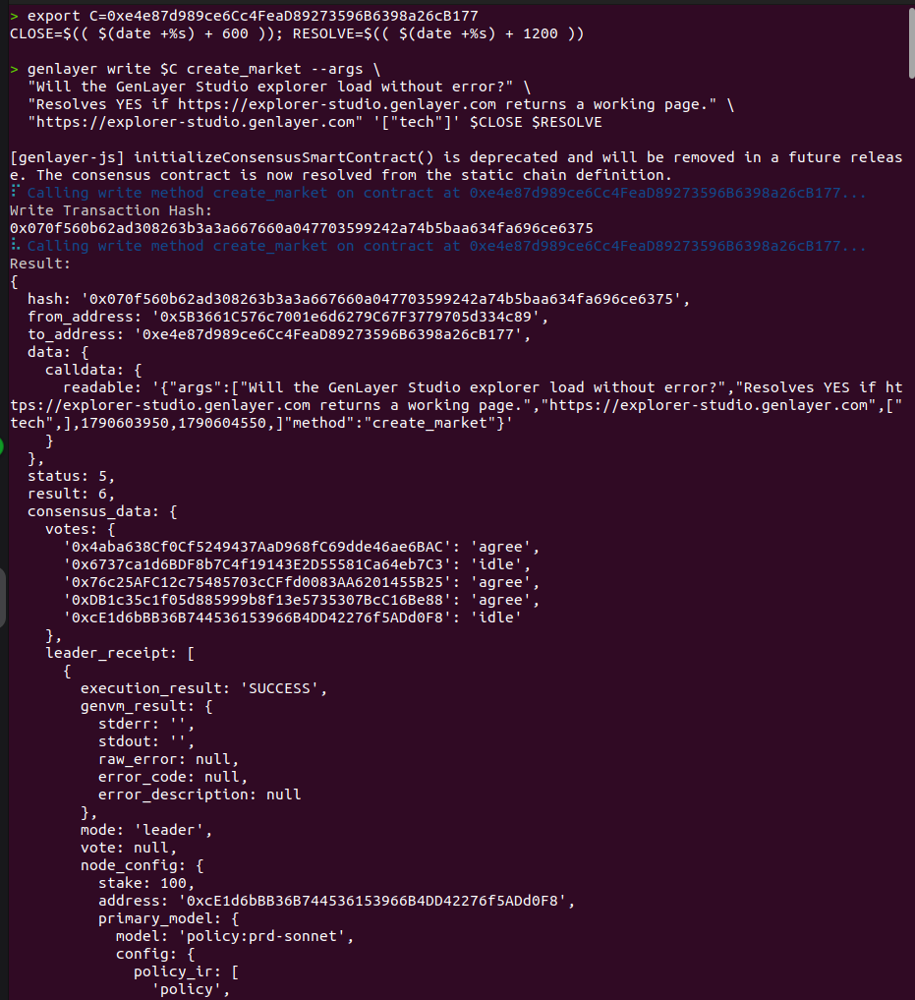
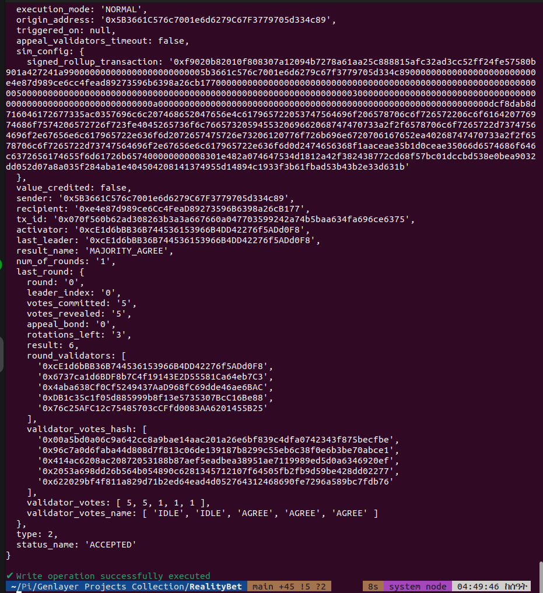
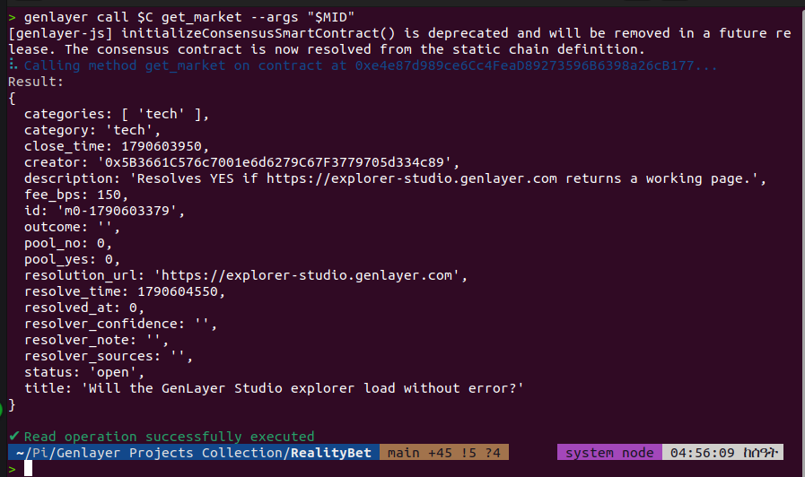
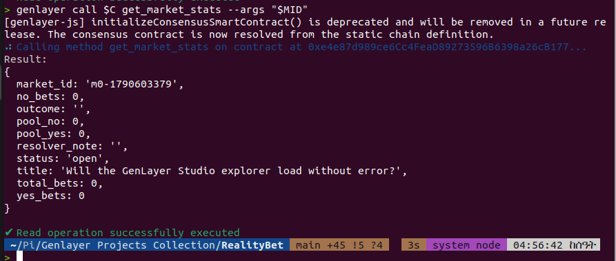
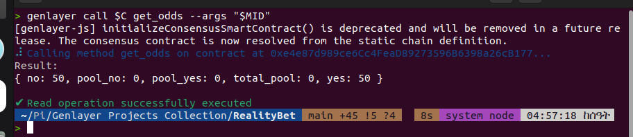
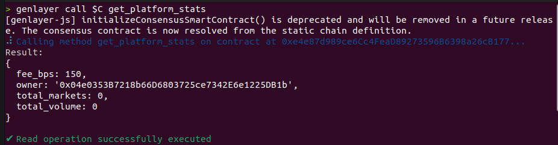

# RealityBet — AI-Resolved Prediction Market Contract

A single GenLayer Intelligent Contract that runs YES/NO prediction markets settled by
validator consensus over live web data. Everything except the *outcome* is deterministic
and on-chain: market creation, betting, pool accounting and parimutuel payout math never
touch the network. The outcome is decided by `gl.eq_principle.prompt_comparative` — the
leader fetches the market's primary source URL and asks an LLM to judge it; validators
independently re-fetch and re-judge, and nothing is written unless they agree.

**This repository is the contract primitive only** — `contracts/` plus a direct-VM test
suite. No frontend, no wallet layer, no off-chain services. Any client (web, mobile,
bot, another contract) can be built on the views below.

| | |
|---|---|
| Contract | [`contracts/RealityBet.py`](contracts/RealityBet.py) — 570 lines, single storage class |
| Tests | [`tests/direct/test_realitybet.py`](tests/direct/test_realitybet.py) — 17 direct-VM tests |
| Deployed (Studio, studionet) | `0xe4e87d989ce6Cc4FeaD89273596B6398a26cB177` |
| Explorer | https://explorer-studio.genlayer.com/address/0xe4e87d989ce6Cc4FeaD89273596B6398a26cB177 |
| Reference client (separate) | https://reality-bet.vercel.app |
| Calling it | [`COMMANDS.md`](COMMANDS.md) — every view and method as a `genlayer call` / `genlayer write` command |
| Deep-dive docs | [`docs/`](docs/) — [ARCHITECTURE](docs/ARCHITECTURE.md), [CONSENSUS](docs/CONSENSUS.md), [INTEGRATION](docs/INTEGRATION.md), [THREAT_MODEL](docs/THREAT_MODEL.md) |
| Verification | [`scripts/preflight.py`](scripts/preflight.py) — 21 offline AST + behavior checks; [`scripts/smoke.sh`](scripts/smoke.sh) — read-only live smoke |
| Evidence | [`examples/`](examples/) — live CLI transcript, view payloads, resolution prompt; [`proof/`](proof/) — sanitized deployment/state/schema captures + [screenshots](proof/screenshots/) of the `create_market` write reaching `MAJORITY_AGREE` |

---

## 1. What makes this a reusable primitive

The interesting part is not the market — it is the **settlement pattern**: a contract
where one field of state is decided by non-deterministic AI, while everything
downstream of that decision (payouts, refunds, fees, dispute state) stays pure integer
arithmetic. Any use case that needs "an LLM reads the world and the chain agrees on what
it said" — event markets, claim adjudication, content moderation, oracle thresholds —
can lift `_resolve` out of this file and reuse the rest of the state machine.

Two design rules the rest of the contract follows:

1. **AI decides, arithmetic disposes.** The LLM returns a decision; it never returns
   money. No LLM output ever reaches `emit_transfer` as a number.
2. **Failure is a first-class outcome.** Anything ambiguous, unparsable or
   low-confidence becomes `VOID`, which pays every bettor back in full. The expensive
   outcome is a confidently wrong answer, so the contract is built to prefer refunds.

---

## 2. Consensus design

```python
def _fetch() -> str:
    web_data = gl.nondet.web.get(url)          # non-deterministic I/O
    body = web_data.body.decode("utf-8")[:6000] # bounded: prompt size is consensus cost
    res = gl.nondet.exec_prompt(prompt + body)  # non-deterministic judgement
    return json.dumps(..., sort_keys=True)      # key-sorted: stable diffs for the comparator

raw = gl.eq_principle.prompt_comparative(
    _fetch, "`outcome` must be exactly the same. All other fields must be similar"
)
```

Why this template and not the alternatives:

- **Not `strict_eq` on the raw LLM string.** Two honest validators can return the same
  verdict with different wording, key order, or a `\n` in the reason. Strict equality on
  free text produces endless failed consensus rounds and appeal storms.
- **Not `prompt_equivalence` alone.** Plain equivalence compares only the two results
  (leader vs validator) and cannot express "these must match *these fields*". The
  comparative template takes a field-level rule, so the outcome can be pinned to
  byte-equality while the prose stays fuzzy.
- **Not a format-only validator.** A JSON-schema check would confirm the reply *is*
  JSON, never whether it is *right*. Only the comparative rule checks semantics.

Non-determinism is confined to `_fetch`: `gl.nondet.web.get` and
`gl.nondet.exec_prompt`. Every validator re-executes both inside the same equivalence
check, so "the source said X" is verified independently rather than trusted from the
leader.

### Consensus failure handling

| Failure | Path | Result |
|---|---|---|
| LLM returns unparsable output | `except` in `_resolve` | market `VOIDED`, refunds open |
| Confidence is `low` and outcome isn't `void` | forced branch | rewritten to `void`, original reason preserved in `resolver_note` |
| Outcome outside `yes/no/void` | forced branch | rewritten to `void` |
| Key-name drift (`result`/`verdict`, `conf`, `sources`) | alias lookup | accepted, normalized |
| Validators disagree beyond the rule | consensus fails | no state change; appeal path |

Outcome, `resolver_note`, `resolver_confidence` and `resolver_sources` are all written
to storage, so a resolved market carries its own audit trail.

---

## 3. State design

```python
markets:     TreeMap[str, Market]        # m<seq>-<ts> → market
bets:        TreeMap[str, Bet]           # b<seq>-<ts> → bet
disputes:    TreeMap[str, Dispute]       # d<seq>-<ts> → dispute
market_bets: TreeMap[str, DynArray[str]] # market  → [bet_id]      (secondary index)
bettor_bets: TreeMap[str, DynArray[str]] # address → [bet_id]      (secondary index)
```

- **Readable, collision-free ids.** Sequential counters plus a timestamp make ids
  human-readable in a receipt (`b7-1735689600`) and impossible to collide within a
  contract instance. `_seq()` parses the counter back out because lexicographic order
  would otherwise put `m10` before `m2`.
- **Two secondary indexes**, so "all bets on this market" and "all bets by this address"
  are storage reads, not full scans. The address index normalizes both sides of the
  lookup (`0x`-prefixed and bare hex) — see the regression test in §6.
- **Batched views.** `get_markets_page` / `get_market_bets_detailed` return full dicts
  for a page of ids, so a client needs one call instead of N. Pagination is capped at 50.
- **u256 throughout** for money and time. Timestamps come from the VM's wall clock
  (`_now()`), which is what an IC can observe.

---

## 4. Lifecycle

```
  OPEN ──close_time──► LOCKED ──resolve_time──► RESOLVED ──► claims open
   │                     │                          │
   │                     │                     [24h window]
   │                     │                          │
   │                     │                       DISPUTED ──► owner ruling
   │                     │                              └──► re_resolve (AI re-runs)
   │                     │
   └─────────────────────┴──► VOIDED ──► refund_void
```

- `create_market` — anyone; `close_time` must be future, `resolve_time >= close_time`,
  1–5 tags from a fixed 20-category list, duplicates dropped, capped at 5.
- `lock_market` — anyone, once `close_time` passes. Permissionless on purpose: nobody
  should be able to keep a market open past its deadline.
- `fund_market` / `place_bet` — payable, `OPEN` only. See the caveat in §5.
- `request_resolution` — anyone, once `resolve_time` passes and the market is `LOCKED`.
  Permissionless so a stuck market can always be settled.
- `claim_winnings` / `refund_void` — bettor only, once per bet (`claimed` flag).
- `raise_dispute` — bettors only, within 24h of resolution.
- `resolve_dispute` / `re_resolve` / `force_resolve` — owner. `re_resolve` re-runs the
  LLM against fresh web state; `force_resolve` is the last-resort override.
- `set_fee` (≤ 5%, hard-capped) / `transfer_ownership` — owner.

Payout ordering is checks-effects-interactions: `claimed` is set and the bet is written
back **before** `emit_transfer` fires, so a re-entrant call finds `claimed == True`.

---

## 5. Money

```
gross = bet_amount × total_pool ÷ win_pool        # integer division, u256
fee   = gross × fee_bps ÷ 10000                   # → owner
net   = gross − fee                               # → winner
losers → 0
VOID   → full refund of the bet amount, no fee
```

Example — 6 GEN YES vs 4 GEN NO, outcome YES, 1 GEN YES bet, 1.5% fee:

```
gross = 1 × 10 ÷ 6 = 1.667 GEN
fee   = 0.025 GEN → owner
net   = 1.642 GEN → bettor
```

Rounding dust from integer division stays in the contract; there is no sweep function.

> **Known limitation — `fund_market`.** `fund_market` splits `msg.value` across *both*
> pools with no bet attached, so those GEN inflate the losing side of the parimutuel
> ratio and the funder can never reclaim them. It exists to give a fresh market non-zero
> odds for display, and is kept because the deployed contract at the address above
> contains it. **Do not use it for real settlement** — `place_bet` is the only funding
> path that preserves payout accounting. Removing it is the first change in any
> production fork.

---

## 6. Method reference

**Market lifecycle** — `create_market`, `lock_market`, `void_market`, `request_resolution`

**Betting & payout** — `fund_market` (see caveat), `place_bet`, `claim_winnings`, `refund_void`

**Disputes** — `raise_dispute`, `resolve_dispute`, `re_resolve`, `force_resolve`

**Views** — `get_market`, `get_market_ids`, `get_markets_page`, `get_market_stats`,
`get_odds`, `get_bet`, `get_bets_by_bettor`, `get_bettor_bets`, `get_market_bets`,
`get_market_bets_detailed`, `get_dispute`, `get_platform_stats`

**Admin** — `set_fee`, `transfer_ownership`

---

## 7. Tests

```bash
pip install genlayer
pytest tests -q        # 17 passed

python3 scripts/preflight.py   # 21 offline checks: AST invariants + behavior harness
scripts/smoke.sh               # read-only live smoke against the deployed contract
```

Direct-VM tests with `mock_web` / `mock_llm`, so no network or LLM call is made:

| Area | Coverage |
|---|---|
| Creation | happy path, multi-category, dedupe + 5-tag cap, invalid category reverts |
| Betting | YES/NO placement, pool split, zero-value rejection |
| Lifecycle | lock before/after `close_time`, void authorization |
| Resolution | YES pays winner, NO pays winner, VOID refunds, **low confidence auto-voids** |
| Payouts | exact fee-split arithmetic, loser gets 0, duplicate claim reverts |
| Disputes | full raise → dispute → resolve flow, non-bettor rejected |
| Storage views | paginated ids newest-first with `m10` vs `m2`, batched views, address index matching `0x`-prefixed **and** bare hex |

---

## 8. Screenshots

Studio playground running and debugging the contract:



Market creation: the `create_market` write submitted from the Studio console:


The same write's transaction receipt, showing it reaching `MAJORITY_AGREE`:



Read views: each of these is a `genlayer call` against the deployed contract.

`get_market` — full state of one market (pools, close/resolve times, outcome, market meta):



`get_market_stats` — per-market totals (bet count, volume, status):



`get_odds` — live parimutuel payout odds for YES vs NO:



`get_platform_stats` — aggregate counters across all markets:



---

## 9. Possible next steps

- Multi-outcome markets (A/B/C) with a generalized `pools: DynArray[u256]`.
- Pull-based liquidity instead of the `fund_market` split, removing the caveat in §5.
- A resolution bond that is slashed when a dispute overturns the AI, so `force_resolve`
  has a cost.
- A streaming/challenge period where validators can flag a resolution before it settles.
